

# JS Downloader

**A Modern, High-Performance Multi-Engine Download Manager & Media Suite for Windows**

[-0078D6?style=for-the-badge&logo=windows&logoColor=white)](#)

*Combining multi-connection segmented HTTP acceleration, 4K/8K streaming media extraction, BitTorrent/Magnet support, a built-in Mobile Browser, and a full Website Cloner inside a sleek Windows 11 Acrylic/Dark/Light interface.*

---

[🎯 Overview](#-overview) •
[📋 Feature List](#-complete-feature-index-at-a-glance) •
[✨ Key Features](#-key-features) •
[📸 Screenshots](#-screenshots--visual-tour) •
[🏗️ Architecture](#️-system-architecture) •
[🛡️ Security](#️-security-engineering) •
[📥 Releases](#-installation--releases)

---

> [!IMPORTANT]
> **🚧 Project Status — Development in Progress:**
> **Development is currently ongoing. Once completed, the final compiled Application / Installer (`.exe`) will be shared here.**
>
> *To protect proprietary core algorithms and security implementations, the source code is maintained in a private repository. This repository serves as an architectural showcase, visual feature tour, and release distribution hub for **JS Downloader**.*

---

## 🎯 Overview

**JS Downloader** is a desktop download accelerator and media acquisition suite built from the ground up in Python and PyQt6. Designed as an all-in-one modern alternative to traditional download managers (like IDM), it unifies **multi-threaded direct file downloading**, **social/streaming video extraction**, **BitTorrent swarm downloading**, **interactive playlist batching**, **an embedded Mobile Browser**, and **automated website cloning** behind a strict, crash-resilient 6-layer architecture.

---

## 📋 Complete Feature Index (At a Glance)

Below is the complete list of features engineered into **JS Downloader**:

- **🚀 Core Download & Media Engines**
  - **Multi-Connection Segmented HTTP/HTTPS Engine (`aria2c`)** — Up to 32 simultaneous connections per file (`64 KB` chunk size)
  - **Instant OS-Level Pause & Resume** — Native Windows `NtSuspendProcess` / `NtResumeProcess` process suspension
  - **1,000+ Site Streaming Video & Audio Extractor (`yt-dlp`)** — YouTube, Shorts, Live, Facebook Watch/Reels, Instagram, TikTok, X/Twitter, Reddit, Bilibili, Vimeo, Twitch, SoundCloud, Dailymotion
  - **HLS (`.m3u8`) & DASH (`.mpd`) Stream Downloader** — Automatic segment fetching and container muxing
  - **Anti-Bot TLS Fingerprint Impersonation (`curl-cffi`)** — Bypasses modern CDN and Cloudflare handshake blocks
  - **Embedded JS Challenge Solver (`QuickJS` / `qjs.exe`)** — Solves dynamic video player signature challenges offline
  - **FFmpeg Stream Muxing & Audio Transcoding (`ffmpeg.exe`)** — Merges separate 4K/8K video+audio streams and converts audio to `MP3`, `M4A`, `OPUS`, `FLAC`, `WAV`, or `AAC`
  - **High-Resolution Thumbnail Extractor** — Standalone cover image downloading (`1080p Max Resolution` down to `120p`)
  - **BitTorrent (`.torrent`) & Magnet (`magnet:`) Client** — Full swarm downloading with DHT, PEX, LSD, 10 built-in public trackers, live seed/peer telemetry, and Windows Registry association

- **🧩 Manifest V3 Browser Extension (Chrome, Edge, Brave, Firefox)**
  - **IDM-Style Floating Video Overlay** — Injects a floating `Download` / `Select Quality` button directly onto video players
  - **3-Tab Inline Format Picker (`Video`, `Audio`, `Image`)** — Choose video resolution, audio bitrate, or thumbnail quality with estimated file sizes inside the browser
  - **YouTube Home Feed Hover Badge** — Download videos directly by hovering over thumbnails on the YouTube home/search feed
  - **YouTube Shorts & Facebook Reels Action Buttons** — Dedicated floating download badges docked next to Shorts/Reels sidebars
  - **1-Click `⚡ Quick Download` Mode** — Zero-prompt instant downloading using the user's preferred quality preset
  - **MAIN-World XHR/Fetch Stream Sniffer (`interceptor.js`)** — Captures dynamically loaded media streams in real time
  - **Browser Context Menu Integration** — Right-click any link, video, or page to send to JS Downloader or Site Grabber
  - **Dual IPC Bridge** — Native Messaging Host (`js_host.exe`) with authenticated localhost HTTP fallback (`127.0.0.1:4970-5050`)

- **📱 Built-in Mobile Browser (`WebView2` + `CDP`)**
  - **Frameless Smartphone UI Shell** — Dedicated mobile viewport (`412×895`, `2.625` DPR) with punch-hole status bar, clock, and locked-aspect-ratio edge/corner resizing
  - **Chromium DevTools Protocol (CDP) Mobile Emulation** — Native 5-point touch emulation, mobile User-Agent override, and Dark/Light `prefers-color-scheme` sync
  - **Floating Side Control Dock** — Quick buttons for Always-on-Top Pin (`📌`), Ad-Block Shield toggle (`🛡️`), Volume Up/Down (`🔊`/`🔉`), and Home (`🏠`)
  - **Customizable Speed-Dial Home Screen** — Built-in Google search bar + 1-click tiles for `YouTube`, `Facebook`, `Instagram`, `TikTok`, `X / Twitter`, `Reddit`, `Pinterest`, `Twitch`, and custom user links (`+ Add Link`)
  - **Brave-Style Ad & Tracker Blocker** — Network-layer ad/tracker domain blocking, YouTube video ad auto-skipper, and feed autoplay blocker
  - **1-Click Floating Media Download Badge** — Glowing bottom-right download button that automatically appears when a playable video/media page is detected

- **📋 Interactive Playlist & Batch Queue Engine**
  - **Smart Playlist URL Detection** — Detects playlist links via clipboard or manual input and prompts `Download Single Video` vs. `Download Entire Playlist`
  - **Lazy Background Format Resolution** — Resolves multi-video metadata asynchronously without freezing the UI
  - **Master Playlist Checklist Dialog** — Select/deselect tracks, view durations & availability, auto-create playlist subfolders, prefix sequential track numbers (`001 - Title.mp4`), and apply bulk `MP4 Video` or `MP3 Audio` quality
  - **Collapsible Grouped Queue Rows (`GroupedDownloadsModel`)** — Groups playlist tracks cleanly in the main dashboard
  - **Starvation-Free Unified Queue Engine (`UnifiedQueueEngine`)** — Fair-share task scheduler with worker lease heartbeats and automatic crash-recovery lease reclamation

- **🕷️ Site Grabber & Full Website Cloner**
  - **All Files Download Mode** — Crawls web pages and bulk-downloads assets sorted into 7 categories (`Photos`, `Videos`, `Audio`, `Documents`, `Archives`, `Fonts`, `Code`)
  - **Full Site Clone Mode** — Mirrors complete websites (`HTML`, `CSS`, `JS`, and binary assets) and rewrites relative links for offline browsing
  - **Crawl Depth & Extension Filtering** — Supports `Unlimited Mode` (`3,000` pages safety cap), `Custom Depth`, and comma-separated file extension filters
  - **Headless Selenium JS Renderer (`js_renderer.py`)** — Optional browser rendering with infinite-scroll capture for JavaScript-heavy websites

- **🖥️ Desktop UI, Smart Automation & System Safety Guards**
  - **3 Theme Modes** — `Dark Mode`, `Light Mode`, and native **Windows Frosted Glass / Acrylic Blur** (`ctypes.windll.dwmapi`)
  - **8 Auto-Categorized Download Folders** — Automatically sorts files into `JS - Videos`, `JS - Music`, `JS - Photos`, `JS - Compressed`, `JS - Documents`, `JS - Programs`, `JS - Playlist`, and `JS - Grabber`
  - **Collapsible Category Sidebar & Status Tabs** — Filter by category, `All` / `Finished` / `Unfinished` tabs, and instant Unicode search (supports Bengali & English)
  - **Adaptive Progress Window Manager** — Single-file telemetry dialog with a **16-Segment Live Chunk Map**, automatically switching to a **Multi-Download Batch Monitor** when multiple tasks run concurrently
  - **Live Global Bandwidth Speed Limiter** — Throttle download speeds on the fly (`Unlimited` or custom speed presets)
  - **Smart Download Scheduler & Queue Planner** — Schedule queues by start/stop time and frequency (`Daily`, `Once`, `Specific Days of the Week`), plus inline per-task scheduling
  - **Post-Download System Power Automation** — Automatically **Shut Down** or **Sleep** the PC when downloads finish, with a 4-second **Safety Cancellation Countdown Dialog**
  - **Smart Clipboard Link Monitor** — Detects copied media/playlist/website URLs and pops up a floating action toast (`Media Link Discovered`)
  - **Dual Windows System Tray Icons & Taskbar Progress** — Main app tray icon + Active Downloads tray icon with live percentage popup list and Windows 11 `ITaskbarList3` taskbar progress bar
  - **Critical Low Disk Space Guard (`DiskSpaceGuard`)** — Monitors drive space in real time and **automatically pauses active downloads** when free space drops below required thresholds
  - **Transaction-Safe Duplicate Policy** — Configurable file conflict handling (`Auto Rename`, `Overwrite`, `Skip`, `Prompt`)
  - **SHA-256 / MD5 Checksum Verifier** — Post-download cryptographic hash verification
  - **Automated Windows Defender Antivirus Scan (`MpCmdRun.exe`)** — Non-blocking background malware scan upon file completion
  - **Defense-in-Depth Security & Crash Recovery** — SSRF & DNS Rebinding Firewall, Windows **DPAPI (`CryptProtectData`)** cookie encryption at rest, Atomic Staging Sandbox (`temp_downloads`), and SQLite3 WAL Single-Writer Queue with `recovery_journal.json`

---

## ✨ Key Features

### 🚀 1. Multi-Engine Download Acceleration
- **Segmented Direct Downloads (`aria2c`)**: Accelerates HTTP/HTTPS downloads using up to **32 simultaneous connections**, complete with a live visual **Chunk Progress Map** and native OS-level process suspension (`NtSuspendProcess`) for instant, zero-loss pause/resume.
- **4K/8K Social & Streaming Video (`yt-dlp` + `curl-cffi` + `FFmpeg`)**: Extracts high-definition video, audio-only streams (`.mp3`, `.m4a`, `.webm`), and high-res thumbnails from 1,000+ platforms including **YouTube (Videos, Shorts, Live), Facebook Reels/Watch, Instagram, TikTok, X/Twitter, Reddit, Bilibili, Vimeo**, and **HLS (`.m3u8`) / DASH (`.mpd`)** streams.
- **TLS Impersonation & JS Challenge Solving**: Uses `curl-cffi` browser fingerprint impersonation and a bundled portable **QuickJS (`qjs.exe`)** runtime to bypass anti-bot and signature challenges seamlessly.
- **BitTorrent & Magnet Client**: Native `.torrent` and `magnet:` protocol handler with DHT, PEX, Local Service Discovery (LSD), live seed/peer metrics, and Windows Registry protocol association.

### 🧩 2. Seamless Browser Extension (Chrome, Edge, Brave, Firefox)
- **IDM-Style Floating Overlay**: Injects a smart **"Select Quality" / "Download"** badge and **"⚡ Quick Download"** button directly over videos, YouTube Home thumbnails, YouTube Shorts, and Facebook Reels.
- **3-Tab Inline Format Picker**: Lets users choose **Video** (`1080p HD` down to `144p`), **Audio** (`M4A` / `WEBM` bitrates), or **Image** (Video Thumbnail up to `Max Resolution 1080p`) with estimated file sizes right inside the browser player.
- **MAIN-World Stream Sniffer**: Intercepts `XHR`/`fetch` media manifests and forwards authenticated session cookies securely via **Browser Native Messaging (`js_host.exe`)** or an authenticated local RPC bridge.

### 📱 3. Built-in Mobile Browser (WebView2 + CDP)
- **Frameless Smartphone Shell**: Features an integrated mobile browser window (`412×895` viewport, `2.625` DPR, touch emulation, punch-hole camera, and floating side control dock) powered by Windows Edge WebView2 and Chromium DevTools Protocol (CDP).
- **Speed-Dial & Brave-Style Ad Shield**: Includes a customizable social media speed-dial launcher and blocks intrusive ads/trackers at the network layer.
- **1-Click Floating Media Badge**: Automatically detects mobile video streams inside the browser and displays a glowing floating download button at the bottom-right corner.

### 📋 4. Interactive Playlist & Starvation-Free Batch Engine
- **Smart Playlist Detection**: Automatically detects playlist URLs (both via clipboard monitoring and URL entry), prompts whether to download the single video or the entire playlist, and resolves formats lazily in the background.
- **Master Playlist Checklist**: Provides a rich batch selection table with track durations, availability status, automatic subfolder creation, and sequential track numbering (`001 - Title.mp4`).
- **Starvation-Free Unified Queue Scheduler**: Ensures large playlist batches never block single manual downloads using fair-share slot allocation and lease heartbeats.

### 🌐 5. Site Grabber & Full Website Cloner
- **All-Files Media Crawler**: Scans web pages (supporting both static parsing and headless **Selenium** JS rendering) to bulk-download categorized assets (`Photos`, `Videos`, `Audio`, `Documents`, `Archives`, `Fonts`, `Code`) with custom file-extension filtering.
- **Full Offline Site Cloner**: Mirrors entire websites (`HTML`, `CSS`, `JS`, and media assets) while rewriting internal links for complete offline browsing.

### ⚙️ 6. Smart Desktop Workflow & Safety Guards
- **Auto-Categorized Storage**: Automatically organizes completed downloads into dedicated folders (`JS - Videos`, `JS - Music`, `JS - Photos`, `JS - Compressed`, `JS - Documents`, `JS - Programs`, `JS - Playlist`, `JS - Grabber`).
- **Critical Low Disk Space Guard**: Continuously monitors free drive space during active downloads and **automatically pauses active tasks** before disk exhaustion can cause file corruption or database crashes.
- **Smart Scheduler & Auto-Shutdown**: Schedule download queues by time and day of the week, and automatically **Shut Down or Sleep the PC** upon completion (protected by a cancellation countdown dialog).
- **Integrity & Antivirus Verification**: Built-in **SHA-256 / MD5 checksum verifier** and automated non-blocking **Windows Defender (`MpCmdRun.exe`)** post-download malware scan.

---

## 📸 Screenshots & Visual Tour

Every major workflow of **JS Downloader** is documented below across **9 functional categories**.

---

### 🖥️ 1. Main Desktop Dashboard & Smart Queue Management

The primary desktop workspace supports **Dark**, **Light**, and **Windows Frosted Glass (Acrylic/Blur)** themes. It features a collapsible category sidebar, quick-launch toolbar (`+ Add URL`, `Site Grabber`, `Playlist`, `Scheduler`, `Mobile Browser`), status filter tabs (`All`, `Finished`, `Unfinished`), and instant multilingual search.

| 🌙 Dark Theme Dashboard | ☀️ Light Theme Dashboard |
| :---: | :---: |
| 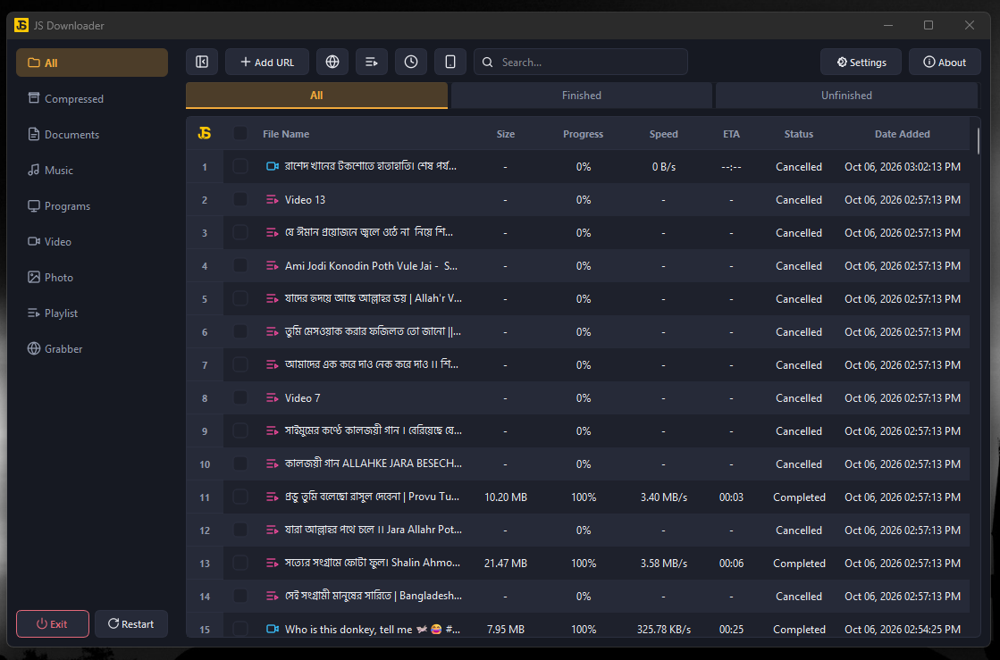 | 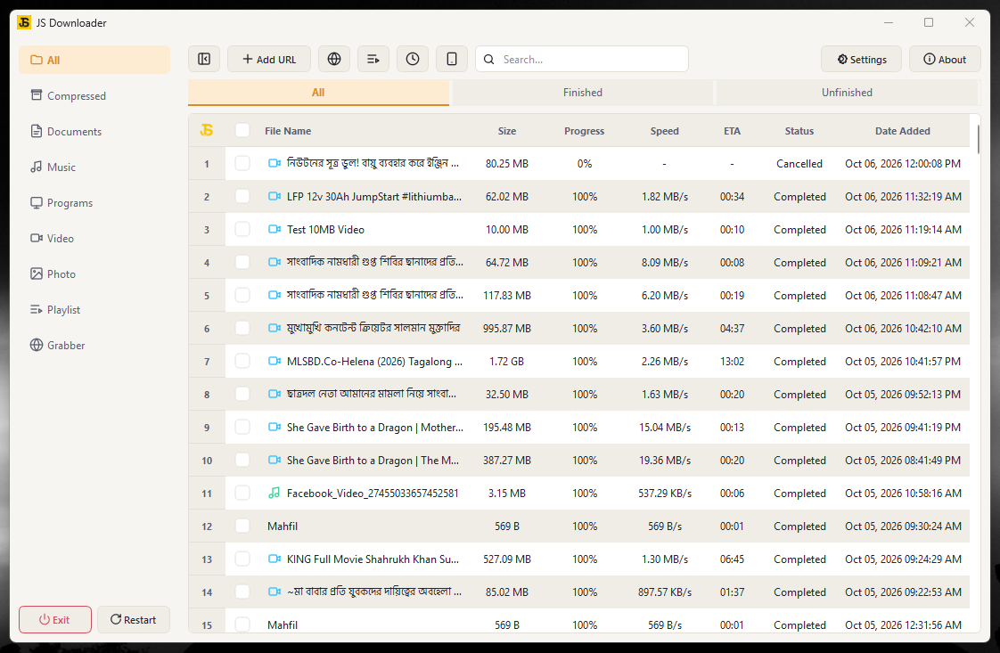 |
| *Main dashboard in Dark Mode displaying categorized sidebar navigation, playlist items, and one-click `Exit` / `Restart` controls.* | *Main dashboard in Light Mode showcasing completed video and audio downloads with transfer speeds up to `19.36 MB/s`.* |

| 📐 Collapsible Sidebar View | 🔍 Instant Multilingual Search (Bengali & English) |
| :---: | :---: |
| 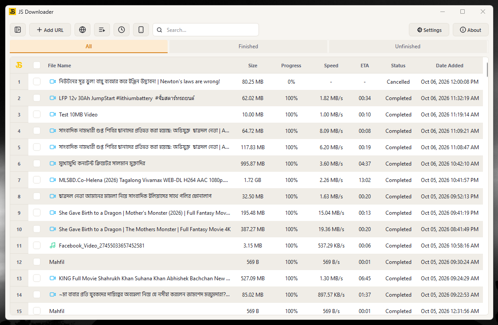 | 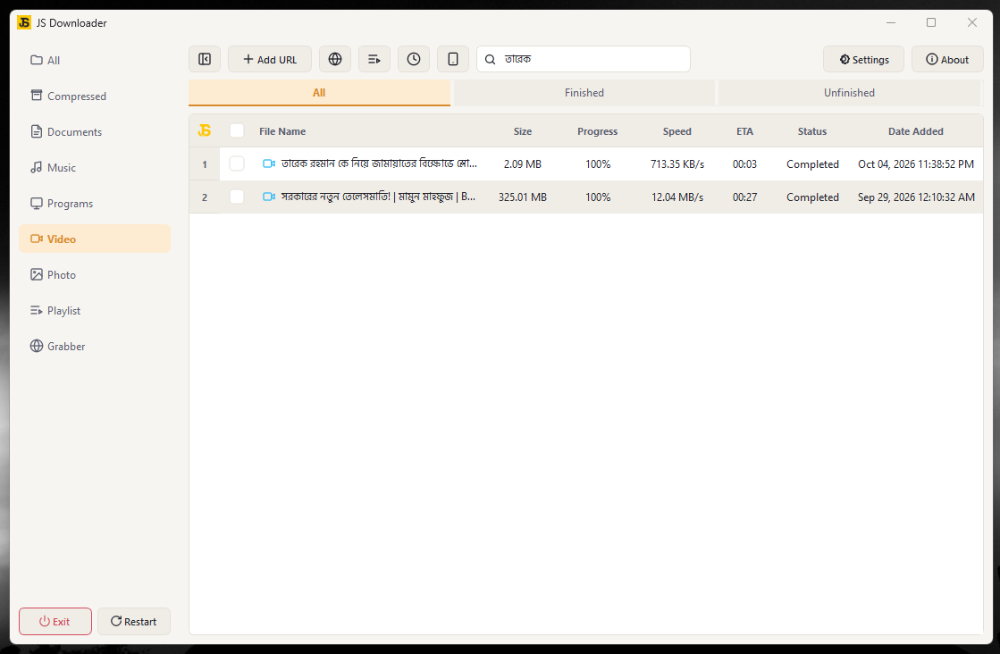 |
| *Sidebar collapsed via the top-left toggle button to maximize horizontal table space for inspecting long filenames and telemetry.* | *Real-time Unicode search bar filtering completed videos by Bengali keywords (`তারেক`) inside the `Video` category.* |

| 🗂️ Category & Status Tab Filtering (`Grabber` + `Unfinished`) | ➕ Manual URL Entry Modal (`+ Add URL`) |
| :---: | :---: |
| 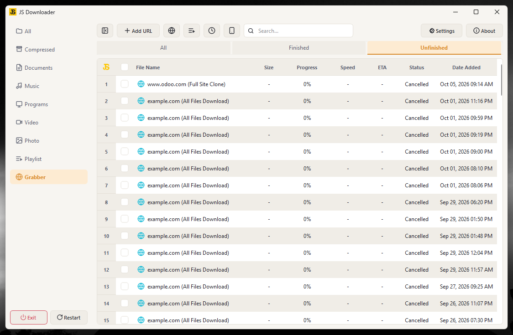 | 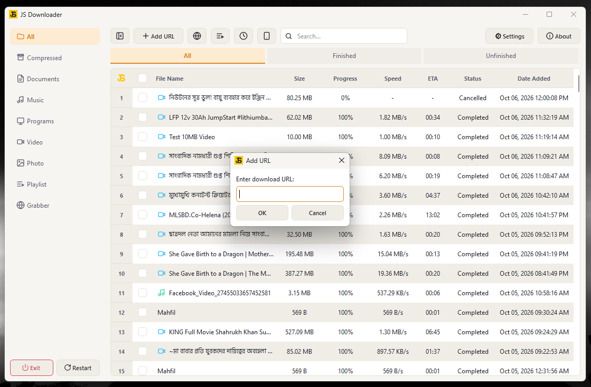 |
| *Filtering `Full Site Clone` and `All Files Download` tasks under the `Grabber` sidebar category and `Unfinished` status tab.* | *Quick URL input modal triggered from the `+ Add URL` button for pasting direct links, streaming videos, or playlists.* |

---

### 🧩 2. Browser Extension & In-Page Floating Media Overlay

The companion **Manifest V3 Browser Extension** injects an IDM-style floating download button directly into web video players and video feeds across **YouTube**, **YouTube Shorts**, and **Facebook Reels/Watch**.

#### 🎬 YouTube Player: 3-Tab Quality Picker (`Video`, `Audio`, `Image`)
| 📹 Video Resolution Tab | 🎵 Standalone Audio Tab | 🖼️ Video Thumbnail Tab |
| :---: | :---: | :---: |
|  |  |  |
| *Lists available MP4 video streams (`1080p HD` down to `144p AV1`) with real-time estimated file sizes.* | *Extracts direct audio streams (`129kbps M4A`, `122kbps WEBM`, etc.) without downloading the video track.* | *Downloads the video's cover thumbnail in `Max Resolution (1080p)` down to `Default Quality (120p)`.* |

#### ⚡ Hover Detection & 1-Click Quick Download Mode
| 🖱️ YouTube Home Feed Hover Overlay | ⚡ 1-Click `Quick Download` Button |
| :---: | :---: |
| 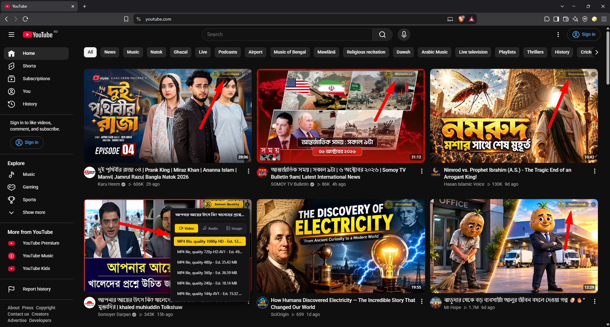 |  |
| *Hovering over any video thumbnail on the YouTube home feed reveals the floating `Download` / `Select Quality` picker without opening the video.* | *When **1-Click Quick Download Mode** is active in Settings, the button switches to `⚡ Quick Download` for instant zero-prompt downloading.* |

#### 📱 YouTube Shorts & Facebook Reels Integration
| ▶️ YouTube Shorts Floating Badge | 📘 Facebook Reels Quality Picker | 📘 Facebook Watch Modal Overlay |
| :---: | :---: | :---: |
| 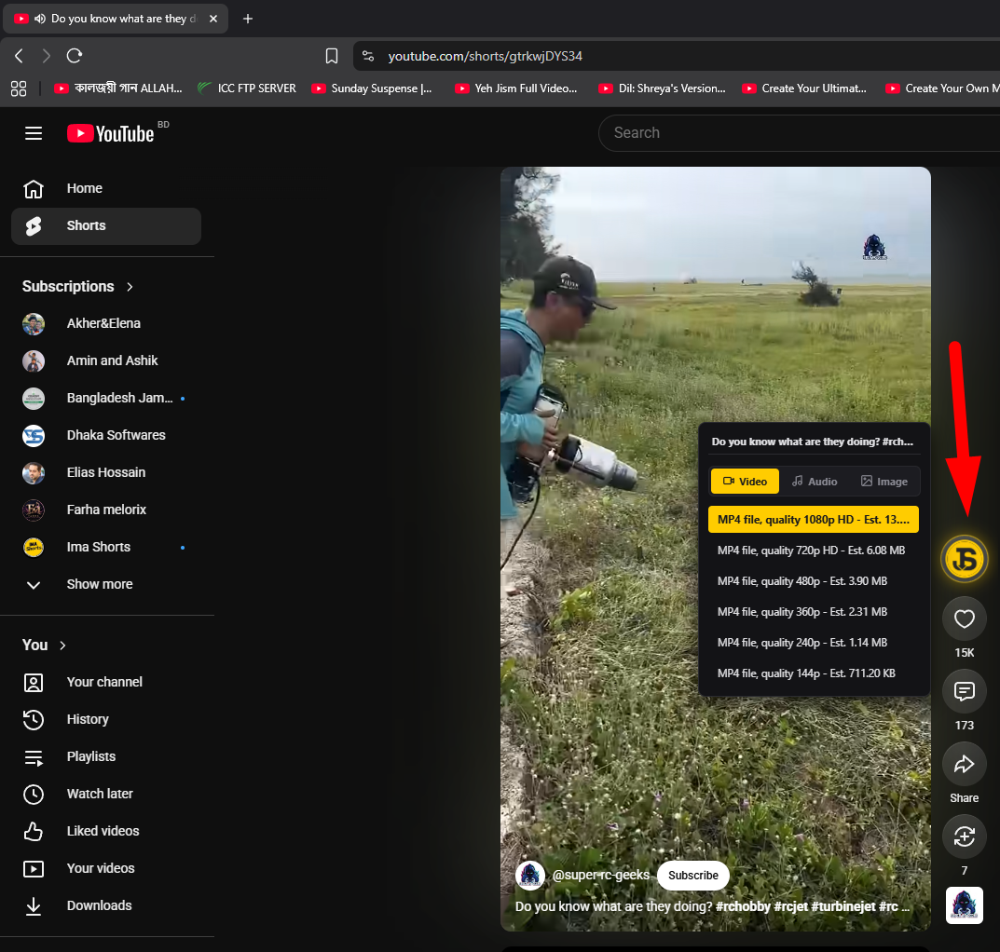 | 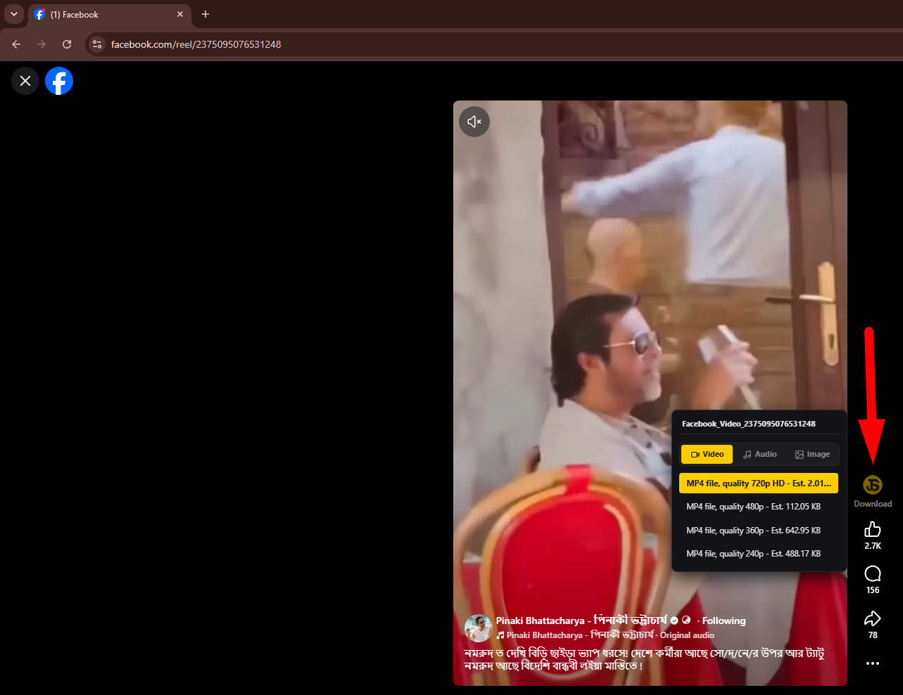 | 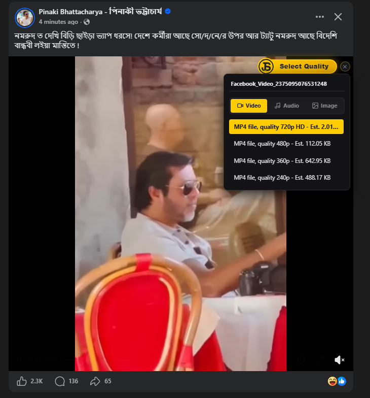 |
| *Docked JS badge beside the YouTube Shorts action bar with full `1080p HD` video, audio, and thumbnail options.* | *Floating download button on Facebook Reels displaying `720p HD` to `240p` stream sizes.* | *Floating `Select Quality` overlay injected directly into the Facebook Watch theater player.* |

---

### 📥 3. Smart URL Probing, Format Configuration & Direct File Interception

When a link is captured, **JS Downloader** probes the URL asynchronously in a background worker and presents a tailored configuration dialog depending on whether the link is a streaming video, a direct binary file, or a web image.

| 🔄 Asynchronous Metadata Probe | 🎞️ Full Media Quality & Audio Configuration |
| :---: | :---: |
| 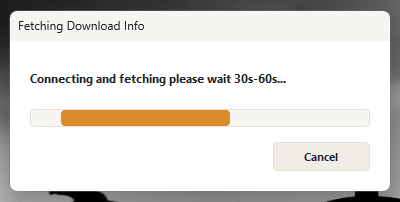 | 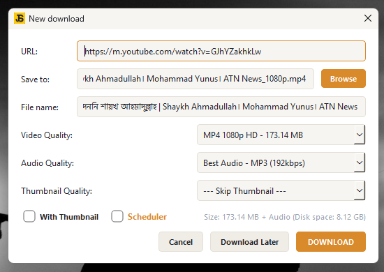 |
| *Non-blocking `Fetching Download Info` dialog while `yt-dlp` and `curl-cffi` resolve available formats and stream sizes.* | *Granular selection for **Video Quality** (`MP4 1080p HD - 173.14 MB`), **Audio Quality** (`Best Audio - MP3 192kbps`), **Thumbnail Quality**, and live free disk space (`8.12 GB`).* |

| ✅ Pre-Selected Extension Stream Dialog | 🗓️ Inline Per-Task Scheduler Configuration |
| :---: | :---: |
| 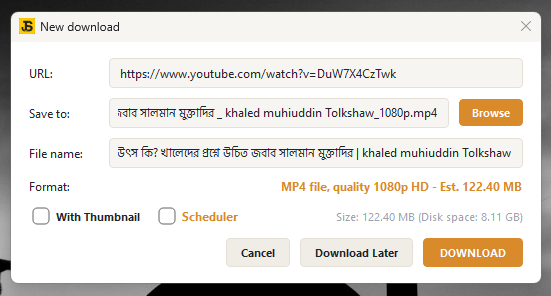 | 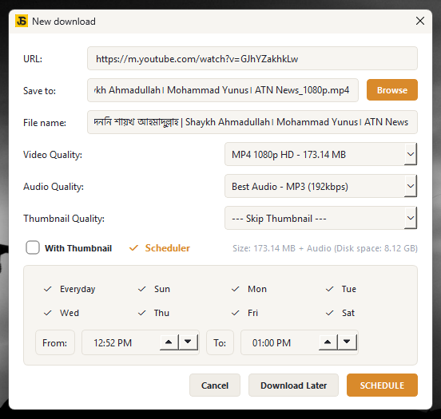 |
| *Streamlined confirmation dialog when a specific resolution (`1080p HD - Est. 122.40 MB`) was already chosen in the browser extension.* | *Checking the `Scheduler` box expands an inline day-of-week (`Everyday`, `Sun`–`Sat`) and time window (`From` / `To`) planner.* |

| 📦 Large Direct File Interception (`1.44 GB .mkv`) | 🖼️ Web Image & Photo Interception (`.webp`) |
| :---: | :---: |
| 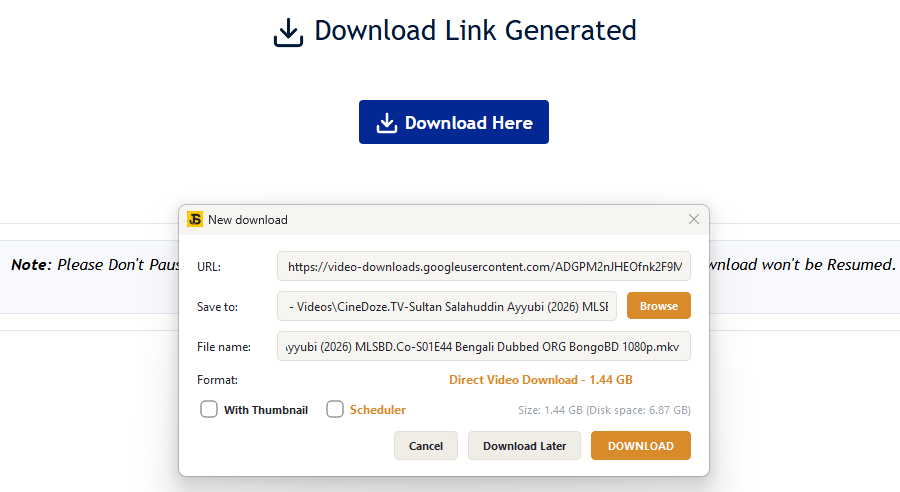 | 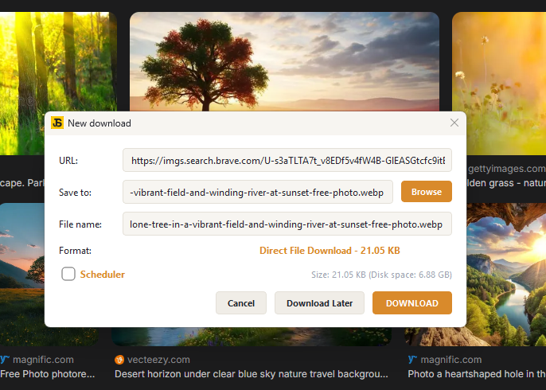 |
| *Intercepting a `1.44 GB` direct video file download from a file host and routing it to the `JS - Videos` category folder.* | *Capturing a direct `.webp` image from web search results with automatic filename population.* |

---

### 📊 4. Adaptive Progress Telemetry & Live Chunk Map

**JS Downloader** features an **Adaptive Progress Window Manager**: it displays a detailed single-file telemetry dialog with a visual multi-connection **Chunk Map** when 1 task is active, and transitions into a multi-file batch monitor when multiple downloads run concurrently.

| 📈 Single-File Progress & 16-Segment Chunk Map | 🎉 Download Complete Summary Dialog |
| :---: | :---: |
| 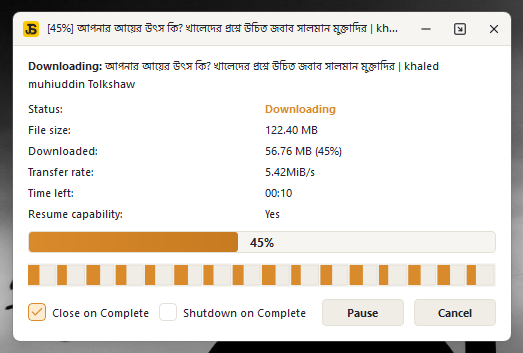 | 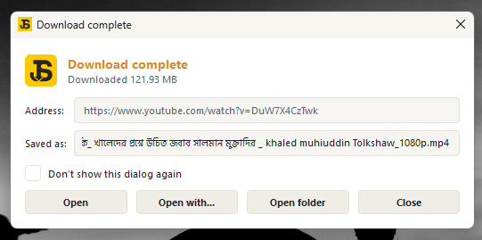 |
| *Real-time transfer speed (`5.42 MiB/s`), ETA (`00:10`), resume support indicator, **visual multi-connection chunk bar**, and `Close/Shutdown on Complete` checkboxes.* | *Completion dialog displaying the source URL, final saved file path, and instant `Open`, `Open with...`, and `Open folder` actions.* |

| ☀️ Multi-Download Batch Monitor (Light Mode) | 🌙 Multi-Download Batch Monitor (Dark Mode) |
| :---: | :---: |
| 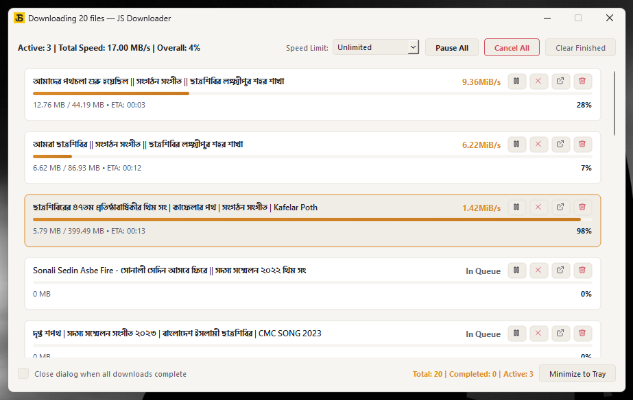 | 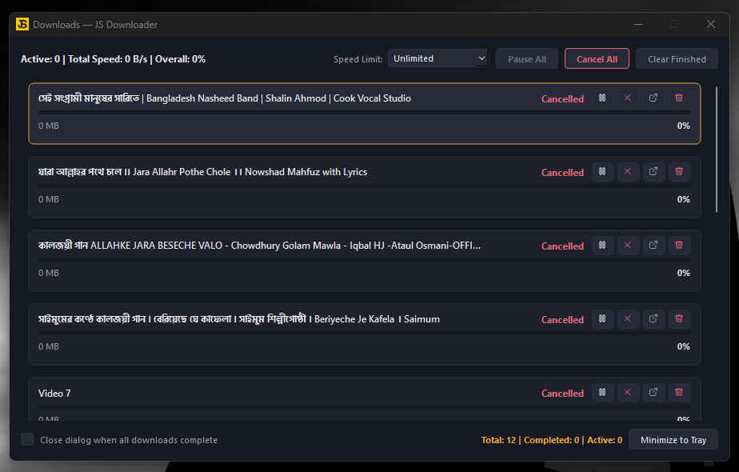 |
| *Concurrent batch download view (`Active: 3 | Total Speed: 17.00 MB/s`) with live `Speed Limit` dropdown, `Pause All`, `Cancel All`, `Clear Finished`, and `Minimize to Tray`.* | *Dark theme view of the multi-download progress window with per-item pause, cancel, open folder, and remove controls.* |

---

### 📋 5. Interactive YouTube Playlist Discovery & Batch Ingestion

When a user copies or pastes a YouTube link associated with a playlist, **JS Downloader** detects the playlist structure and offers a dedicated batch ingestion workflow.

| 📋 Clipboard Playlist Toast | 🔀 Single Video vs. Entire Playlist Prompt |
| :---: | :---: |
| 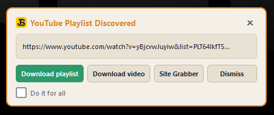 | 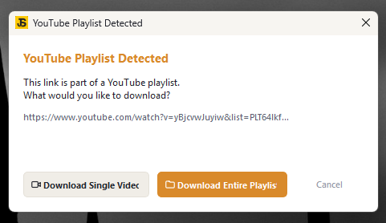 |
| *Smart clipboard popup (`YouTube Playlist Discovered`) offering `Download playlist`, `Download video`, `Site Grabber`, or `Dismiss`.* | *When a link contains both a video and a playlist ID, asks whether to `Download Single Video` or `Download Entire Playlist`.* |

#### 📑 Master Playlist Checklist & Batch Format Selector
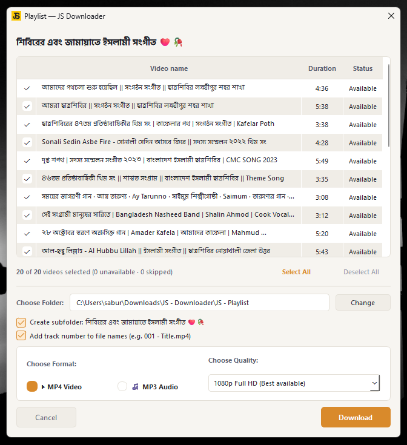
*Displays all discovered playlist videos (`20 of 20 videos selected`) with individual durations and availability status, automatic playlist subfolder creation, sequential track numbering (`001 - Title.mp4`), format toggle (`MP4 Video` vs. `MP3 Audio`), and global quality selection (`1080p Full HD`).*

---

### 📱 6. Built-in Mobile Browser (WebView2 + CDP)

For platforms that serve cleaner streams on mobile viewports, **JS Downloader** embeds a frameless smartphone browser powered by Microsoft Edge WebView2 and Chromium DevTools Protocol (CDP) mobile emulation.

| 🖥️📱 Mobile Browser Alongside Desktop App (Light) | 🌙📱 Mobile Speed-Dial Home Screen (Dark) |
| :---: | :---: |
| 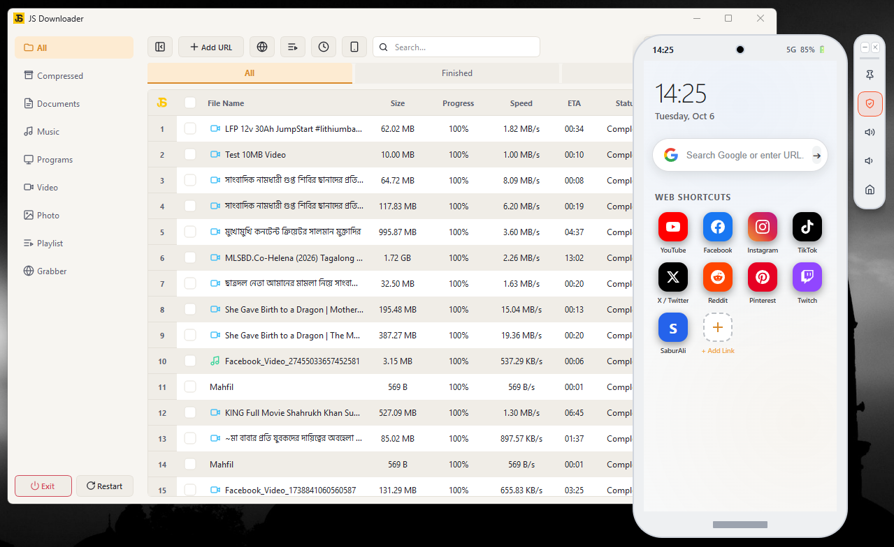 | 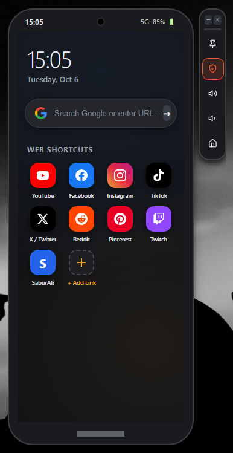 |
| *Frameless smartphone shell (`5G 85%`, punch-hole camera, floating side toolbar) docked beside the main desktop window.* | *Dark-mode mobile home screen featuring Google Search and quick shortcuts (`YouTube`, `Facebook`, `Instagram`, `TikTok`, `X / Twitter`, `Reddit`, `Pinterest`, `Twitch`).* |

| 🛡️ Mobile Browsing with Built-in Ad Shield | ⬇️ 1-Click Floating Media Download Badge |
| :---: | :---: |
| 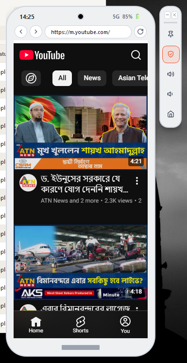 | 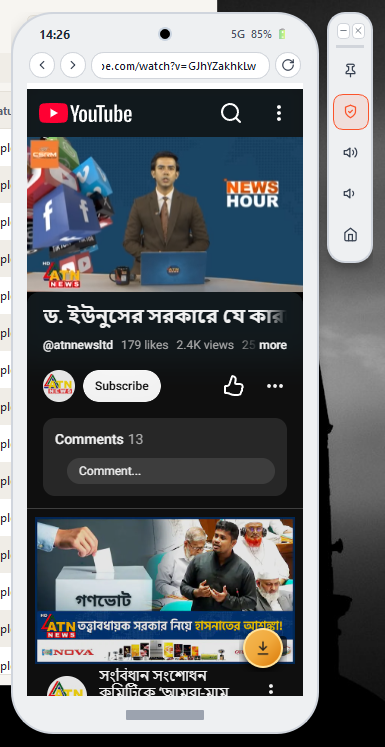 |
| *Browsing `m.youtube.com` inside the emulated mobile viewport with the orange **Ad & Tracker Blocker Shield** active on the side dock.* | *Opening a video page automatically activates the glowing orange **floating download button** at the bottom-right corner for 1-click downloading.* |

---

### 🕷️ 7. Site Grabber & Full Website Cloner

The built-in **Site Grabber** allows users to either extract categorized media/files in bulk (`All Files Download`) or mirror an entire website for offline browsing (`Full Site Clone`).

| ☀️ Site Grabber Configuration (Light Mode) | 🌙 Site Grabber Configuration (Dark Mode) |
| :---: | :---: |
| 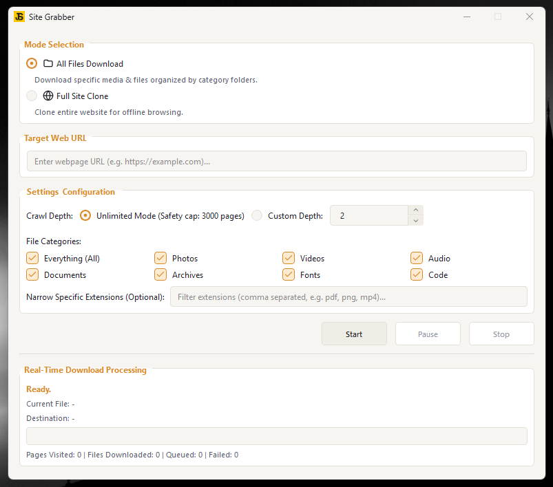 | 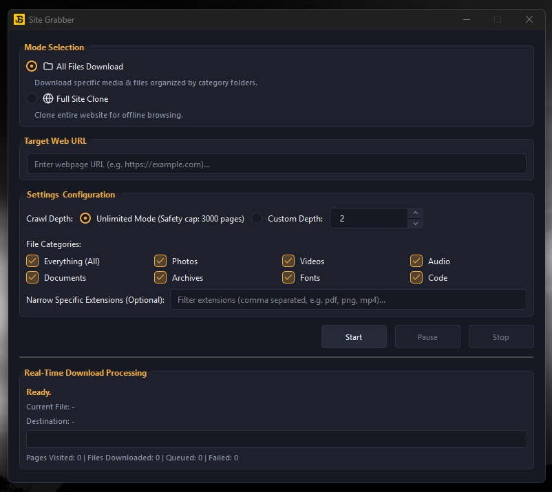 |
| *Configure crawl mode (`All Files Download` vs. `Full Site Clone`), crawl depth (`Unlimited Mode` safety cap of 3,000 pages or `Custom Depth`), asset categories (`Photos`, `Videos`, `Audio`, `Documents`, `Archives`, `Fonts`, `Code`), and custom extension filters.* | *Dark theme view of the Site Grabber configuration interface.* |

#### ⚡ Real-Time Website Crawling & Categorized Asset Extraction
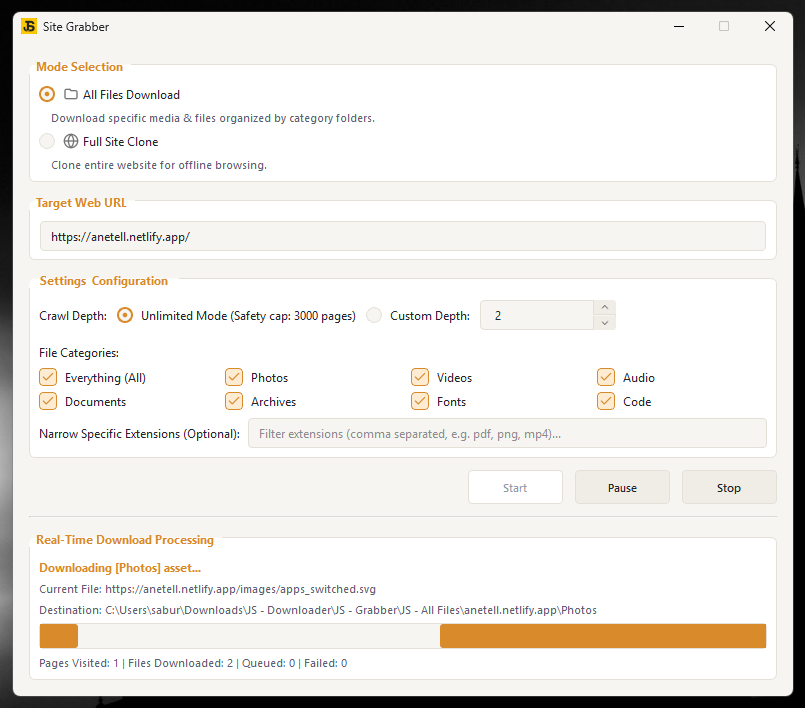
*Live crawling telemetry displaying the current asset being fetched (`apps_switched.svg`), auto-categorized destination path (`...\JS - Grabber\JS - All Files\anetell.netlify.app\Photos`), and real-time counters (`Pages Visited: 1 | Files Downloaded: 2 | Queued: 0 | Failed: 0`).*

---

### ⏰ 8. Smart Scheduler, Clipboard Monitor & System Tray Integration

**JS Downloader** integrates deeply into the Windows desktop environment with background clipboard monitoring, a recurring queue scheduler, dual system tray icons, and post-download power automation.

| 🌙 Smart Download Scheduler (Dark Mode) | ☀️ Smart Download Scheduler (Light Mode) |
| :---: | :---: |
| 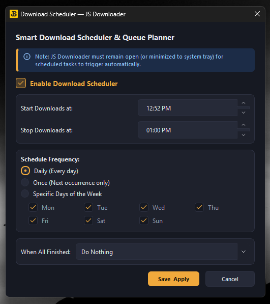 | 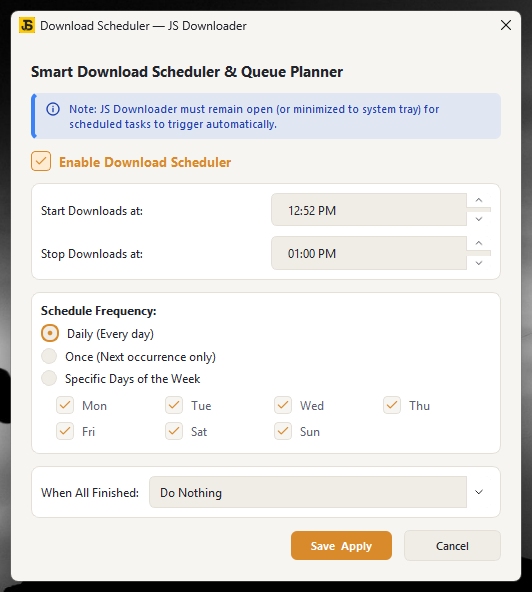 |
| *Configure automatic queue start/stop times, schedule frequency (`Daily`, `Once`, or `Specific Days of the Week`), and post-queue power actions (`When All Finished`).* | *Light theme view of the Smart Download Scheduler & Queue Planner.* |

| 🔗 Smart Clipboard Link Monitor Toast | 🔔 Background Download Complete Toast |
| :---: | :---: |
| 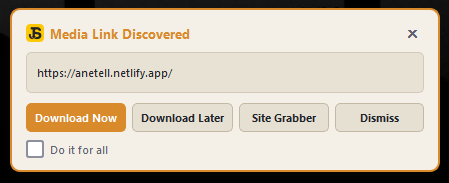 | 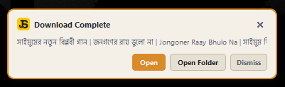 |
| *Copying any media or web URL triggers a non-intrusive `Media Link Discovered` toast with `Download Now`, `Download Later`, and `Site Grabber` buttons.* | *Compact desktop notification toast when a background download completes, offering instant `Open` and `Open Folder` buttons.* |

| 📌 Dual Windows System Tray Icons | 📜 System Tray Active Downloads Popup | ⚠️ Auto-Shutdown Safety Countdown |
| :---: | :---: | :---: |
| 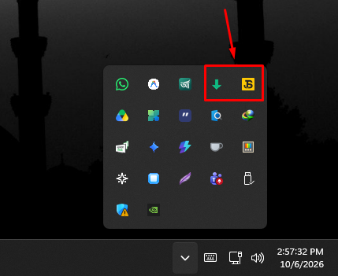 | 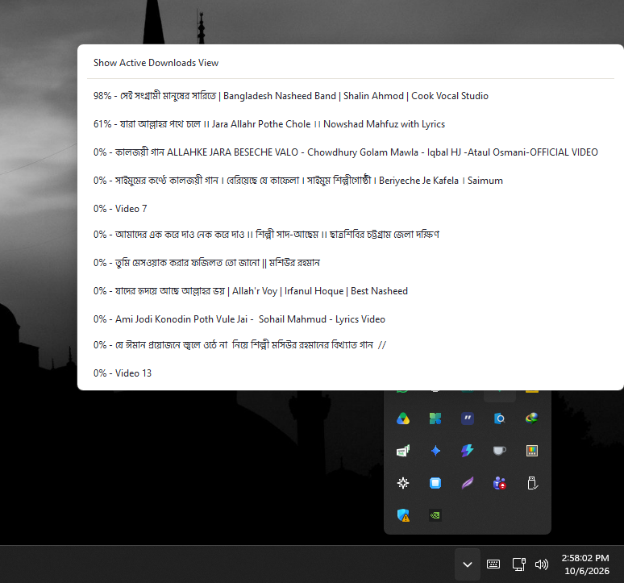 | 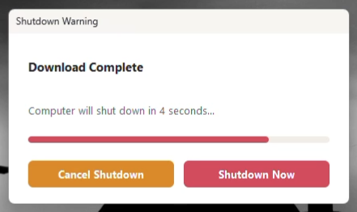 |
| *Dedicated tray icon for **JS Downloader** alongside a live **Active Downloads** status icon in the Windows system tray.* | *Clicking the active download tray icon pops up a real-time percentage list of running and queued tasks.* | *Safety countdown modal (`Computer will shut down in 4 seconds...`) with a `Cancel Shutdown` button when `Shutdown on Complete` triggers.* |

---

### ⚙️ 9. Settings, Appearance & System Safety Guards

Fine-tune connection concurrency, conflict policies, visual effects, and proactive hardware safeguards.

| ⚙️ General Settings & Concurrency Control | 🎨 Theme & Windows Frosted Glass Settings |
| :---: | :---: |
| 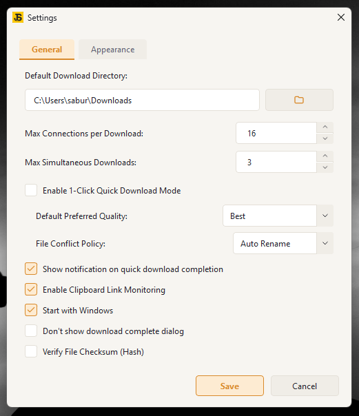 | 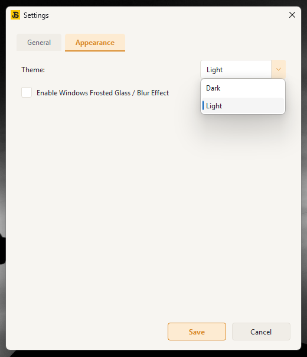 |
| *Configure default download directory, `Max Connections per Download` (`16`/`32`), `Max Simultaneous Downloads`, `1-Click Quick Download Mode`, `File Conflict Policy` (`Auto Rename`), clipboard monitoring, Windows startup, and `Verify File Checksum (Hash)`.* | *Switch between `Dark` and `Light` themes and toggle the native **Windows Frosted Glass / Blur Effect**.* |

| 🔄 1-Click Mode Hot-Restart Prompt | 🛡️ Critical Low Disk Space Guard |
| :---: | :---: |
| 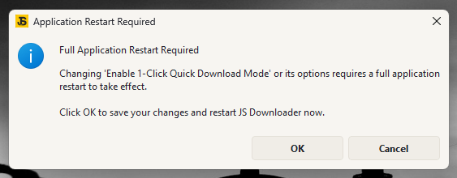 | 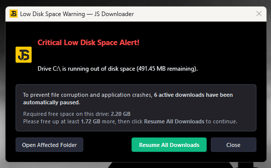 |
| *Prompts to save changes and automatically restart the application when toggling `1-Click Quick Download Mode`.* | *Proactively detects low drive capacity (`491.45 MB remaining` vs. `2.20 GB required`) and **automatically pauses active downloads** to prevent file corruption or crashes.* |

---

## 🏗️ System Architecture

**JS Downloader** enforces a strict **6-Layer Clean Architecture** verified by automated boundary tests (`test_architecture_boundaries.py`). Lower layers have zero knowledge of upper GUI layers, ensuring high testability and thread safety.

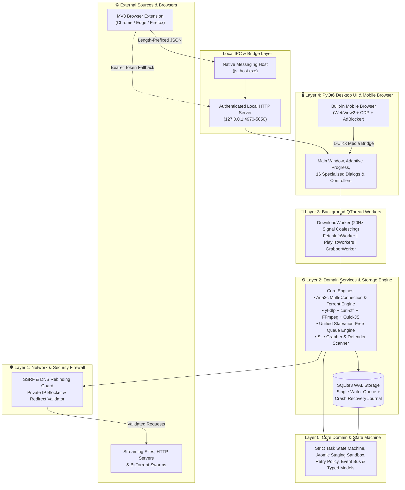
```mermaid
flowchart TD
    subgraph External["🌐 External Sources & Browsers"]
        EXT["MV3 Browser Extension\n(Chrome / Edge / Firefox)"]
        WEB["Streaming Sites, HTTP Servers\n& BitTorrent Swarms"]
    end

    subgraph IPC["🔌 Local IPC & Bridge Layer"]
        NH["Native Messaging Host\n(js_host.exe)"]
        SRV["Authenticated Local HTTP Server\n(127.0.0.1:4970-5050)"]
    end

    subgraph L4["🖥️ Layer 4: PyQt6 Desktop UI & Mobile Browser"]
        GUI["Main Window, Adaptive Progress,\n16 Specialized Dialogs & Controllers"]
        MB["Built-in Mobile Browser\n(WebView2 + CDP + AdBlocker)"]
    end

    subgraph L3["🧵 Layer 3: Background QThread Workers"]
        DW["DownloadWorker (20Hz Signal Coalescing)\nFetchInfoWorker | PlaylistWorkers | GrabberWorker"]
    end

    subgraph L2["⚙️ Layer 2: Domain Services & Storage Engine"]
        ENG["Core Engines:\n• Aria2c Multi-Connection & Torrent Engine\n• yt-dlp + curl-cffi + FFmpeg + QuickJS\n• Unified Starvation-Free Queue Engine\n• Site Grabber & Defender Scanner"]
        DB[("SQLite3 WAL Storage\nSingle-Writer Queue +\nCrash Recovery Journal")]
    end

    subgraph L1["🛡️ Layer 1: Network & Security Firewall"]
        SEC["SSRF & DNS Rebinding Guard\nPrivate IP Blocker & Redirect Validator"]
    end

    subgraph L0["🧱 Layer 0: Core Domain & State Machine"]
        CORE["Strict Task State Machine, Atomic Staging Sandbox,\nRetry Policy, Event Bus & Typed Models"]
    end

    EXT -->|"Length-Prefixed JSON"| NH
    EXT -.->|"Bearer Token Fallback"| SRV
    NH --> SRV
    SRV --> GUI
    MB -->|"1-Click Media Bridge"| GUI
    GUI --> DW
    DW --> ENG
    ENG --> DB
    ENG --> SEC
    SEC -->|"Validated Requests"| WEB
    ENG --> CORE
    DB --> CORE
```

### Architectural Highlights
- **Non-Blocking Persistence (`DatabaseWriterQueue`)**: All SQLite mutations are serialized through a dedicated writer thread in **WAL (Write-Ahead Logging)** mode alongside an atomic `recovery_journal.json`, eliminating `database is locked` errors under heavy multi-connection concurrency.
- **20Hz UI Signal Coalescing**: Background workers throttle and coalesce high-frequency progress callbacks before emitting Qt signals, keeping the desktop UI responsive at 60 FPS even during gigabit downloads.
- **Atomic Staging Sandbox**: Active downloads are written to an isolated staging directory with lease heartbeats and only moved to the user's final destination folder upon verified completion.

---

## 🛡️ Security Engineering

Unlike typical desktop utilities that blindly pass URLs to subprocesses, **JS Downloader** implements defense-in-depth security controls:

| Security Domain | Implementation Details |
| :--- | :--- |
| **SSRF & DNS Rebinding Firewall** | Validates every URL and manual redirect hop in Python against private, loopback (`127.0.0.0/8`, `::1`), link-local, and cloud metadata IP ranges before execution. Locks `aria2c` with `--max-redirect=0`. |
| **DPAPI Cookie Encryption at Rest** | Browser session cookies captured for authenticated downloads are encrypted in SQLite using the **Windows Data Protection API (`CryptProtectData`)** tied to the current OS user, and automatically wiped once the download finishes. |
| **Hardened Local IPC Server** | Binds strictly to `127.0.0.1`, enforces an exact browser extension Origin allowlist, validates dynamic tokens via constant-time `hmac.compare_digest`, and caps request payload sizes to prevent memory exhaustion. |
| **Process Tree Supervision** | Tracks all spawned `aria2c`, `ffmpeg`, and `qjs` child processes via a centralized `ProcessSupervisor` to guarantee clean teardown and zero orphaned background processes. |

---

## 🧰 Tech Stack

- **Core Language**: Python 3.10 – 3.12
- **Desktop GUI**: PyQt6 (`6.11.0`), QtPy, Windows DWM API (`ctypes.windll.dwmapi` for Dark Mode & Acrylic/Mica translucency), Windows `ITaskbarList3` Taskbar Progress
- **Embedded Mobile Browser**: `qtwebview2` (Microsoft Edge WebView2), `pythonnet`, Chromium DevTools Protocol (CDP)
- **Download & Media Engines**:
  - `yt-dlp` + `curl-cffi` (TLS fingerprint impersonation) + `QuickJS` (`qjs.exe`)
  - `aria2c` (Multi-connection HTTP/HTTPS & BitTorrent/Magnet engine)
  - `FFmpeg` (Stream muxing, audio transcoding, metadata/thumbnail embedding)
  - `BeautifulSoup4`, `requests`, `Selenium` (Site Grabber & headless JS rendering)
- **Database**: SQLite3 (WAL mode, custom migration runner up to schema v13, single-writer queue)
- **Browser Extension**: Manifest V3 (JavaScript ES6, CSS3, Native Messaging API, WebRequest/DeclarativeNetRequest)
- **Packaging & Installer**: PyInstaller (`6.5.0`) + Inno Setup 6 (`installer_setup.iss`)
- **Testing & Quality**: Pytest (`60+` test suites covering unit, Qt GUI, security, stress, and E2E flows), Ruff, Mypy

---

## 📥 Installation & Releases

> [!NOTE]
> **Development is currently in progress. The final Application (`JS_Downloader_Setup.exe`) will be shared in the [**Releases**](../../releases) section once completed.**

Once released, the installer will automatically configure:
1. The main **JS Downloader** desktop application (`aria2c`, `ffmpeg`, and `qjs` bundled).
2. **Browser Native Messaging Hosts** for Chrome, Edge, Brave, and Firefox.
3. Windows Registry associations for `magnet:` links and `.torrent` files.
4. The companion **JS Downloader Browser Extension** for floating video download buttons inside your browser.

---

**Designed & Engineered with ❤️ for High-Speed Media & File Acquisition**

